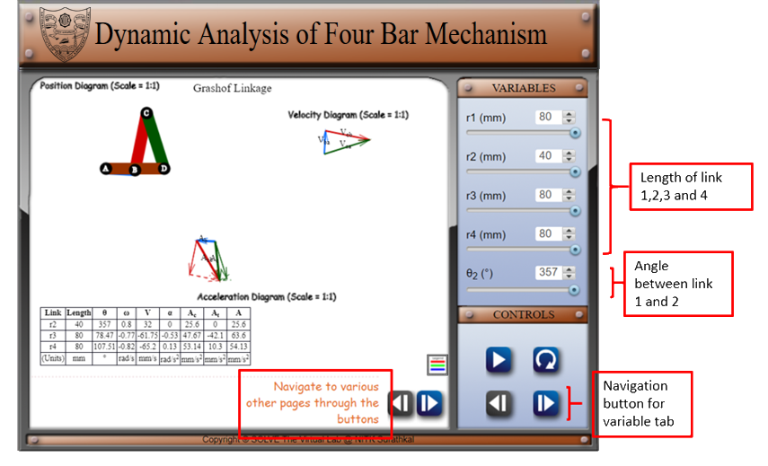
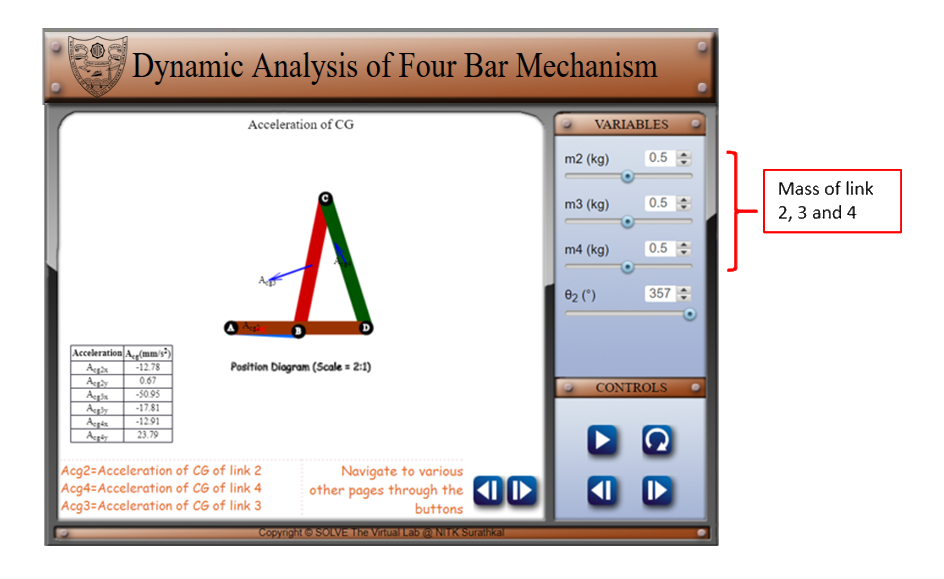
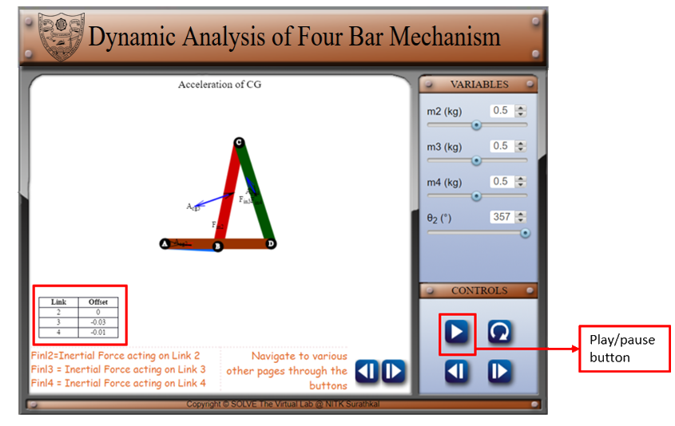
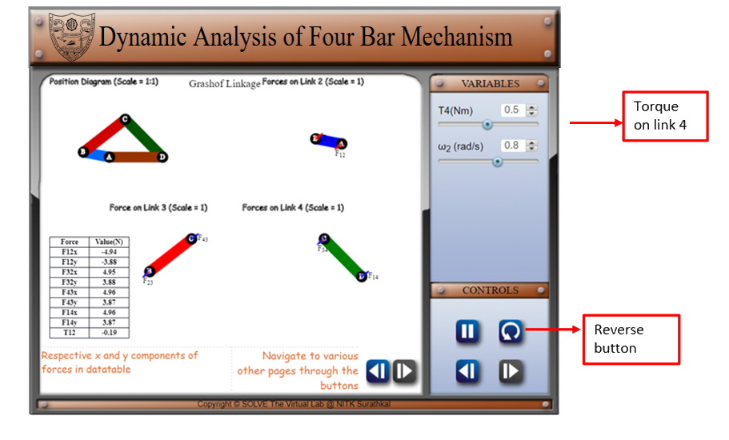

#### These procedure steps will be followed on the simulator

1. In simulation window the motion of position diagram, velocity and acceleration diagram is shown.
2. There are pointers given on right side of the screen under the variable tab to change the values of r1, r2, r3, r4 and theta 2, and navigation, play/pause and reverse button under control tab. Navigation buttons given on the simulator screen for the navigation of the simulator screen.
 

3. After moving on to the next page of simulator screen and variable tab, change value of m2, m3, m4 of the link, the acceleration of center of gravity of the link is shown. 
 

4. Navigate to the next page of the simulator screen. And analyse the offset analysis results from the table after pausing the animation,
 

5. Navigate to the next page of simulator screen and variable tab and change T4, and reverse the animation using the control tab, in simulator observe the force acting on each link.
 
