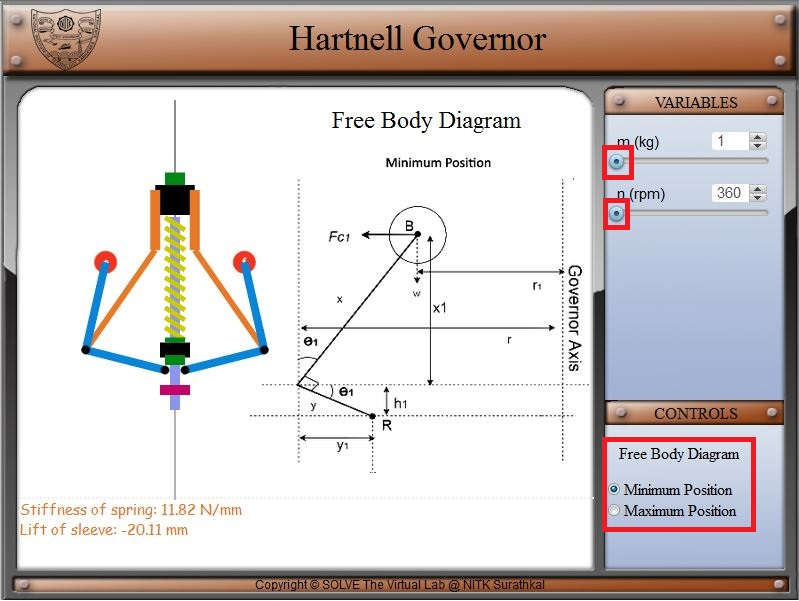
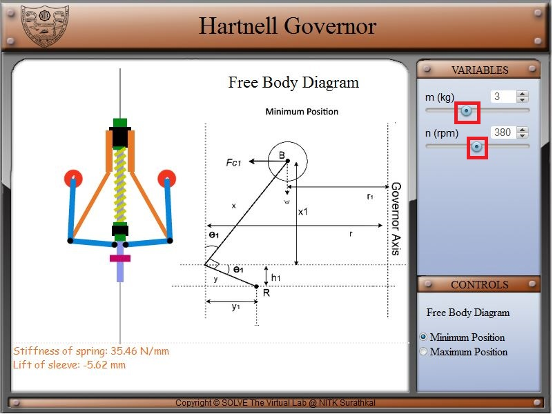
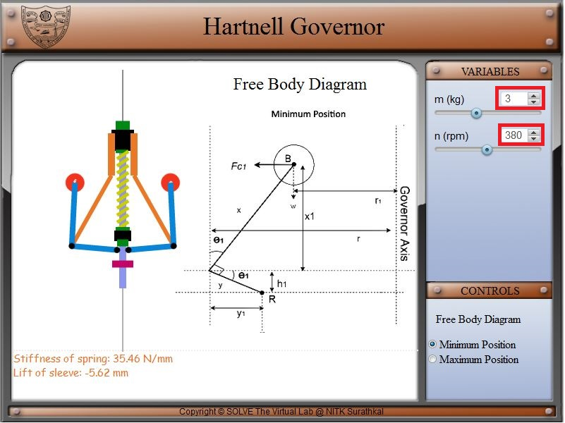
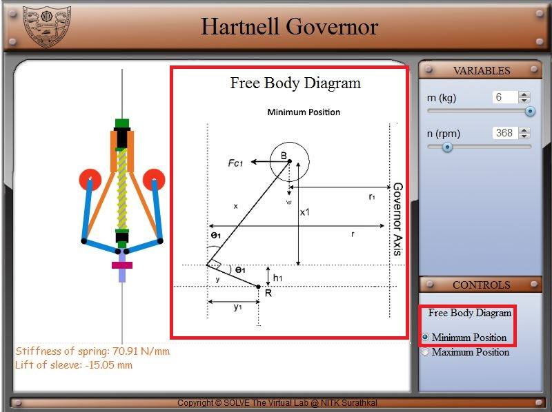
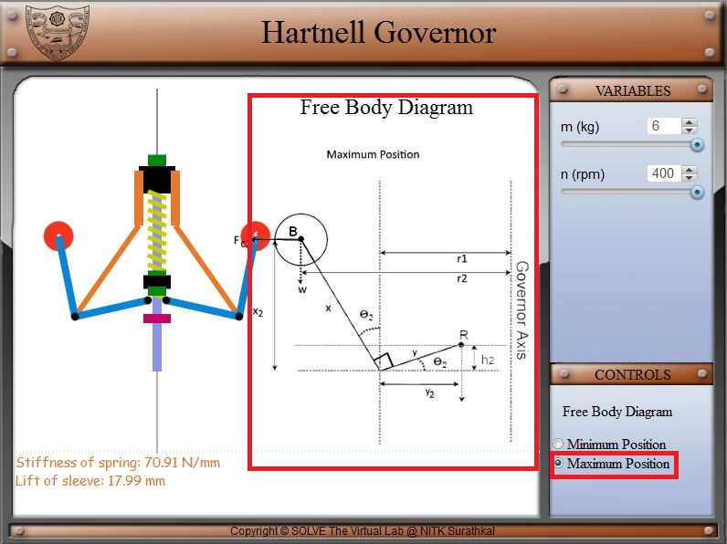

#### These procedure steps will be followed on the simulator

1. In simulation window front view and free body diagram of Hartnell governor is given. 

2. Speed control pointer is given on top left of the screen, above it mass of flyball pointer is given and on the bottom left two checkbox for the displaying free-body diagram at minimum position and maximum position is available. 
 

3. Move the slider knob to the right, this causes the rotational speed to change from 360 to 400 rpm.Move the slider knob to the right, this causes the mass to change from 1 to 6 kg. 
 

4. Change rotational speed from 360 to 400 rpm can be obtained by changing the arrow marks above the slider. Similarly for mass. 
 

5. When Minimum position checkbox is checked, free body diagram for Minimum position of hartnell diagram is displayed. 
 

6. When Maximum position checkbox is checked, free body diagram for Maximum position of hartnell diagram is displayed. 
 
