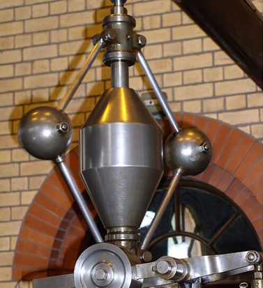

## INTRODUCTION 

#### Learning Objectives:
  * Identify the parts of a porter governor such as flyball, spindle, link, arms, dead weight, sleeve
  * Explain the working and uses of porter governor
  * Derive governing equation of the porter governor
  * Observe the variation in links, arms and spindle of porter governor due to change in rotational speed.
  * Plot the graph of rotational speed vs height of governor for set of pre-determined points. Note down the minimum and maximum height of governor to its rotational speed and write conclusion.

#### Theory
Governors, in general, are most useful means of controlling or regulating the speed of an engine based on varying levels of the load at the output. They are used in regulating the speed of the engine, which takes to the fact that the fuel injected is based on the speed variations seen along the shafts.
          

Source: (<a href="https://www.mecholic.com">https://www.mecholic.com</a>)

Porter governor is a dead weight type of gravity controlled centrifugal governor. The centrifugal governor works on the principle of centrifugal force, which gets applicable on the rotating balls. These balls are known as fly balls, which is attached to the spindle through links. The balls rotate with a spindle which is rotated by the engine through a bevel gear. The upper ends of the arms are pivoted to the spindle, so that the balls may rise up or fall down as they revolve about the vertical axis. The arms are connected by the links to a sleeve, which is keyed to the spindle. This sleeve revolves with the spindle; but can slide up and down. The balls and the sleeve rises when the spindle speed increases, and falls when the speed decreases. This controls the throttle valve thus regulating the fuel intake of the engine, hence controlling the speed. In Porter governor, fly balls are attached at the junction of two links, central load is attached to the sleeve.<a href="references.html">[2]</a>

#### Equations/formulas:
Mathematical equation:

 Mass of each ball (kg)  
 Weight of each ball =  (N)  
 Mass of central load (N)   
 Height of governor (m) 
  Angle of inclination of the arm (rad) 
 Angle of inclination of the link (rad)  

 

 

 

 

Hence,

<a href="references.html">  [2]</a>

