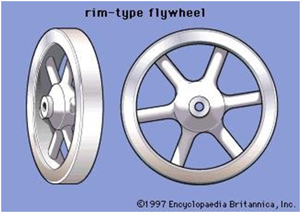

## INTRODUCTION 

#### User Objectives and Goals:

1. Define the basic structure of Rim type flywheel and how to differentiate with other type of flywheel
2. Describe the behavior of Rim type flywheel when its rotating
3. Calculate the time in which the mass will descend certain height H
4. Assess the conservation of energy equation use it to calculate theoretical and experiment moment of inertia.
5. Combine and compare the time taken to touch the ground by metal bob for both rim type and disc type flywheel

#### Theory
A flywheel is a mechanical device which is designed to efficiently store rotational energy. It is an inertial energy-storage device. It absorbs mechanical energy and serves as a reservoir, storing energy during the period when the supply of energy is more than the requirement and releases it during the period when the requirement of energy is more than the supply.

Flywheels have an inertia called the moment of inertia and thus resist changes in rotational speed. The amount of energy stored in a flywheel is proportional to the square of its rotational speed. A flywheel is a spinning wheel or disc with a fixed axle so that rotation is only about one axis.

The single cylinder engine is a prime candidate for the use of a flywheel. The intermittent nature of its power stroke makes one mandatory as it will store kinetic energy needed to carry the piston through the Otto cycle’s exhaust, intake, and compression stroke during which work must be done in the system.<a href="references.html">[1]</a>

An imported application of a flywheel is in a mechanical press where for a fraction of time high energy is required for actual punching, shearing or forming. This energy is supplied by the flywheel. During the longer non active period, the speed of the flywheel is built up slowly by a low powered motor. Thus, the motor is not overloaded and also results in energy saving.<a href="references.html">[2]</a>

In Rim type of flywheel, the mass of the flywheel is concentrated at the rim only i.e. not throughout the radius but only at the radius which is just opposite to disc type, thus imparting higher moment of inertia than disc type.

#### Equations/formulas:

In this experiment, the potential energy of mass m is converted into its translation kinetic energy and rotational kinetic energy of flywheel and some of the energy is lost in overcoming frictional force. The conservation of energy equation at the instant when the mass touches the ground can be written as

 

Here  is the velocity of mass and  is the angular velocity of flywheel at the instant when the mass touches the ground. Here  is the frictional energy lost per unit rotation of the flywheel and it is assumed to be steady.  is the number of rotations completed by the flywheel, when the mass attached string has left the axle.

Even after the string has left the axle, the fly wheel continue to rotate and its angular velocity would decrease gradually and come to a rest when all is rotational kinetic energy has been used by the frictional energy. If  is the number of rotations made by the flywheel after the string has left the axle,

Substituting equation (2) in equation (1)

The expression for the moment of inertia can be written as equation (4) by taking 

Where,

 is the mass moment of Inertia of Disc=  
 is mass 
 is acceleration of gravity 
 is height 
 is the velocity of mass 
 is the angular velocity 
 is the frictional energy lost per unit rotation 
 is the number of rotations completed by the flywheel 
 the number of rotations made by the flywheel after the string has left the axle<a href="references.html">[3]</a> 

  

Source: (<a href="https://www.britannica.com/technology/rim-type-flywheel">https://www.britannica.com/technology/rim-type-flywheel</a>)

